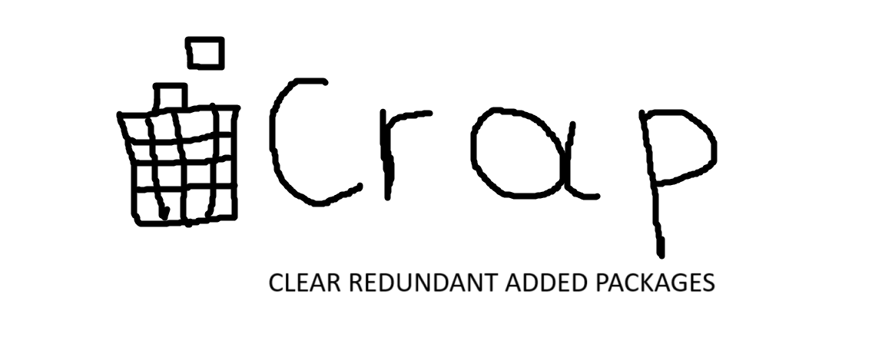

<p align="center">
    
</p>

<h1 align="center">CRAP - CLEAR REDUNDANT ADDED PACKAGES</h1>


# About

Crap deletes redundant/unused python packages from virtual environments, and yeah it does that automatically.

# Installation

 ### Using Pip

  ```bash
  pip install just-crap
  ```

 ### Cloning the GitHub Repository

  1. **Clone the Repository:**

      ```bash
      git clone https://github.com/ValdonVitija/crap.git
      ```
  2. **Navigate to the Repository:** Change your working directory to the cloned repository:

      ```bash
      cd crap
      ```
  3. **Install pyggester as a pacakge locally:** 
        > [!IMPORTANT]
        > If you're not doing this inside a venv, you don't deserve crap!
    
        ```bash
        pip install .
        ```

# Usage (Step-by-Step)


### Step 1 
Navigate to your project directory and activate your venv.

```bash
(venv) root@user:~/my_app> crap project_dir
```
>[!IMPORTANT]
> Crap assumes you're a pro who knows that every python project deserves its own venv, therefore it cleans your currently activated venv.

>[!NOTE]
> You can also navigate to your projects root directory. Inside the repository directory and just:

```bash
(venv) root@user:~/my_app> crap

```
### Step 2

Oh... you're done. That was it. I mean, why should you even bother learning how to use crap? It's not like it's a complex tool or anything. It just does exactly what the name suggests. So, if you're really determined to waste your time, here's the next section for you.


# Detailed Explanations

> [!WARNING]
> NERD ALERT, NERD ALERT... just kidding!


Crap has some options that you can use to tweak some small things. First of all, if you want to see these options on your own, just ⬇️:

`Execution command`
```bash
crap --help
```

```bash
 Usage: crap [OPTIONS] [PATH_]

╭─ Arguments ────────────────────────────────────────────────────────────────────╮
│   path_      [PATH_]  path to file/files [default: .]                          │
╰────────────────────────────────────────────────────────────────────────────────╯
╭─ Options ──────────────────────────────────────────────────────────────────────╮
│ --important           -i       TEXT  Add a package to the list of important    │
│                                      packages                                  │
│                                      [default: None]                           │
│ --remove              -r       TEXT  Remove a package from the list of         │
│                                      important packages                        │
│                                      [default: None]                           │
│ --flush               -f             Remove all packages from the list of      │
│                                      important packages                        │
│ --show                -s             Show all important packages               │
│ --factory-reset       -fr            Reset all settings to default             │
│ --install-completion                 Install completion for the current shell. │
│ --show-completion                    Show completion for the current shell, to │
│                                      copy it or customize the installation.    │
│ --help                               Show this message and exit.               │
╰────────────────────────────────────────────────────────────────────────────────╯
```

Crap comes with a list of "important" packages. These packages are like the cool kids in school, they don't really contribute to your project's source code, but they have their own cli or something fancy that you are mostlikely using as a dev tool. To get the default list of packages, just do this:

`Execution command`
```bash
crap --show
#or
crap -s
```
The shown packages won't be removed in any way.

Alright, so you're still determined to embrace your inner nerdiness. Well, guess what? Crap has got you covered! You can add a new important package to the list and feel even more like a coding wizard. Check it out:

`Execution command`
```bash
#an example here would be a dev package name, just like pytest
crap --important package_name
#or
crap -i package_name 
```

YEP, thats it.
To flush all the default important packages, we've got you covered! We understand that even the nerdiest of nerds sometimes need a fresh start. Just execute this command and watch the magic happen:

`Execution command`
```bash
crap --flush
#or
crap -f
```

Did you fuck it up... yeah. Cuz mostlikely crap just 'craped' your venv.


Oh no! Looks like someone had a change of heart after flushing their important packages. But fear not, because crap isn't just crap. You can easily revert back to the original list of important packages and save yourself from the venv deletion drama. Just follow these simple steps:

1. Take a deep breath(although unnecessary)
2. Don't panic.(I would)
3. Revert back the original list of important packages with a single command:

`Execution command`
```bash
crap --factory-reset
#or
crap -fr
```


👏 Congratulations! You've just made me incredibly proud. It seems I'm not the only one who embraces their inner nerdiness. If you're looking to take your nerd game to the next level, why not contribute to crap and make it even crappier? There's no fancy contribution guide here. Just do whatever you think is necessary and make a pull request. Oh, and if you're feeling extra ambitious, it would be greatly appreciated if you could include tests for any new features.

